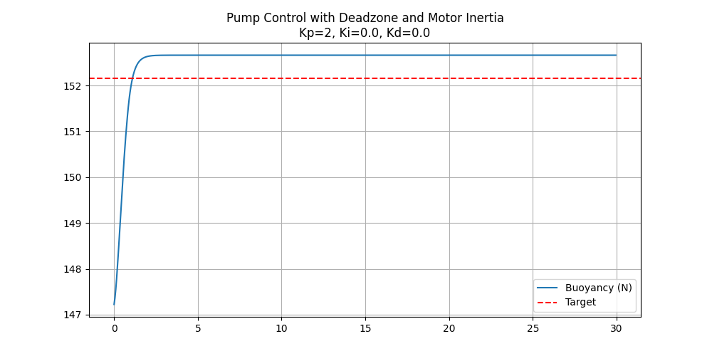
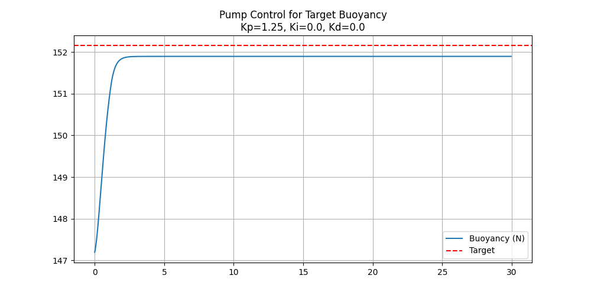
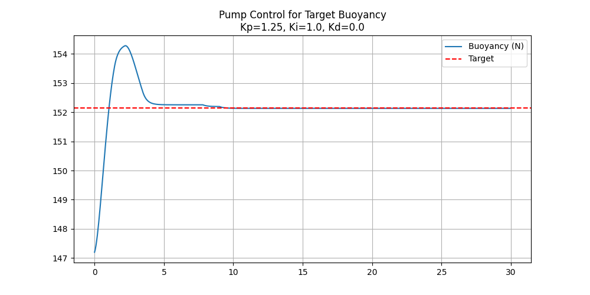
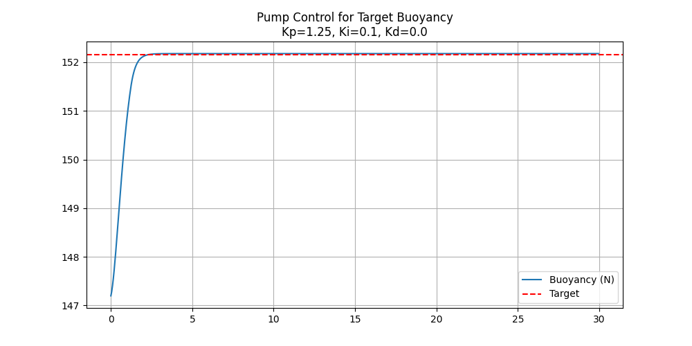
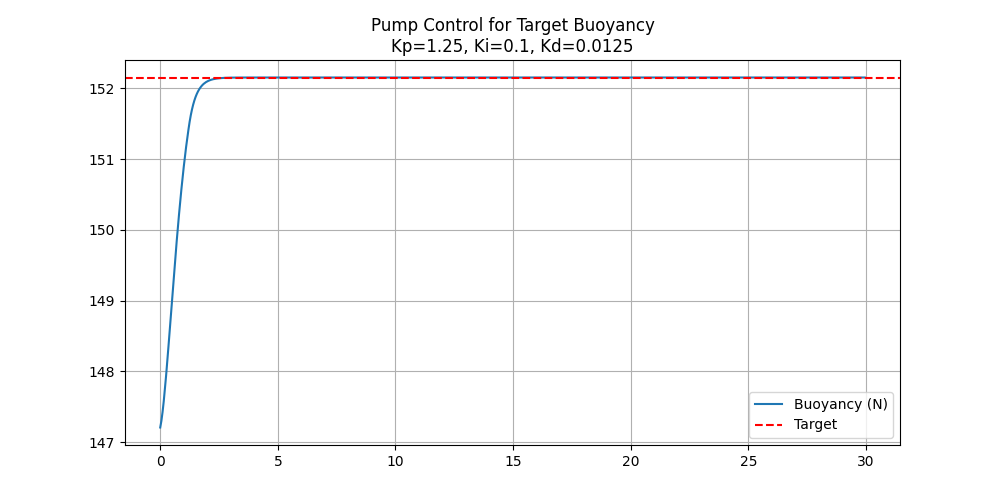
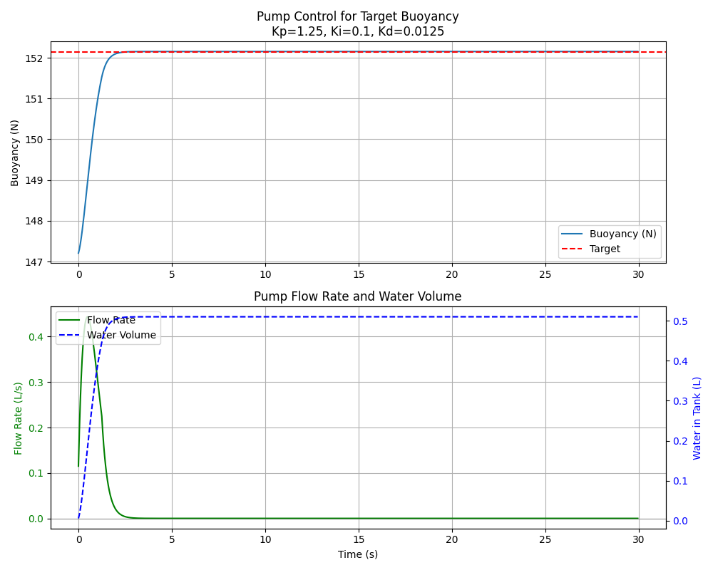
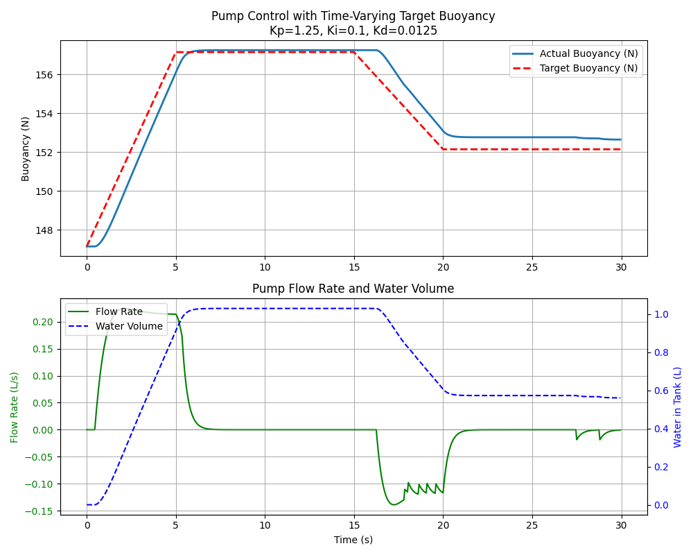
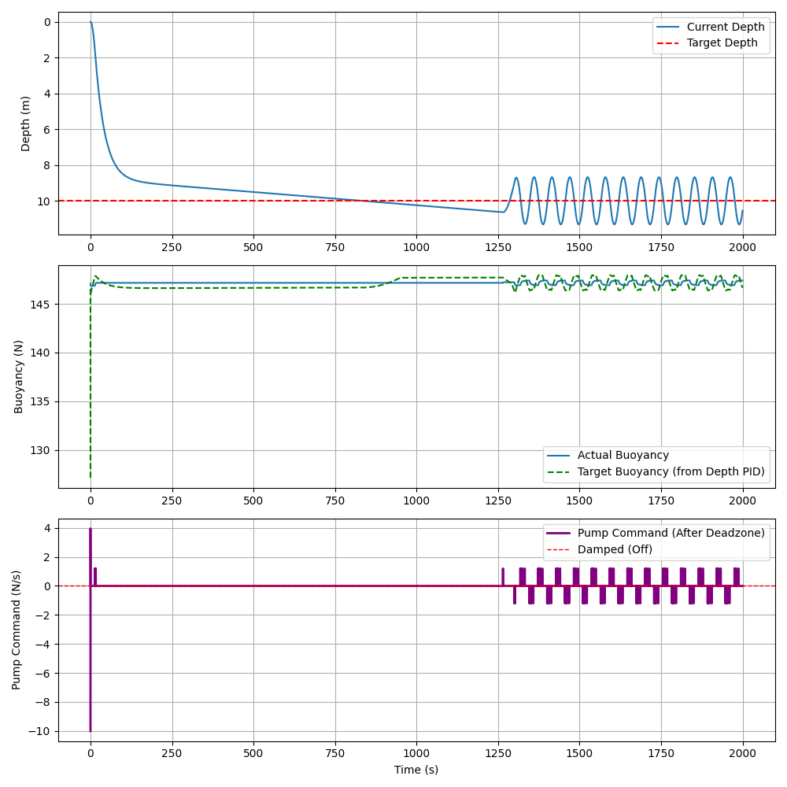

Based on my findings from the last lab I decided on two separate PID loops to help overcome the distance between rate of flow into ballast tanks and actual depth position (2 integrals at least). So one control loop achieves a desired buoyancy by changing the flow of water into the ballast tank.

## Pump Control

This assumes a deadzone between 0% and 12% of operation for the DC motor along with some water inertia. This is what causes P to not be enough because we reach a steady state too early or too late.

First I tuned Kp. First I overshot:

Then I undershot (which can be corrected by Ki):

Then I tuned Ki. At first I made it too high:

Then I got it really nice:

But then I added some Kd in order to keep it on the target over the long term:

Then I visualized what this looks like for the pump which seems reasonable and acceptable for a DC motor (you can't see that any value under 12% of operation is damped):

Finally, I tested this and tuned it for a moving target (because the other control will always be adjusting the target buoyancy):

## Buoyancy Control

I tuned all the values very meticulously to get the sub to approach the target over the short term (it still takes a while for it to get there because it needs to go slowly because of the dampening on the DC motor; i.e., it can't make tiny adjustments which leads to major overshooting with too much speed)

The problem is that over the long term, because it can't make small adjustments (limitations of the DC motor), after enough time to drift it begins to oscillate violently.

I tried A LOT to get this to not happen but either we need to disable the control flow over the long term (i.e., you set the depth, it gets there and then just allows drift until you set a new target), or we need to create a separate control for the long term depth holding. Another option is to add a component that can make more micro adjustments (another vertical propeller, more precise pump / tank. I'm not sure.

Overall for this lab I furthered my understanding of PID control and how we might implement it in our submarine. It's going to be tough, but I hope we can use these principles to implement a very good automated depth control system.